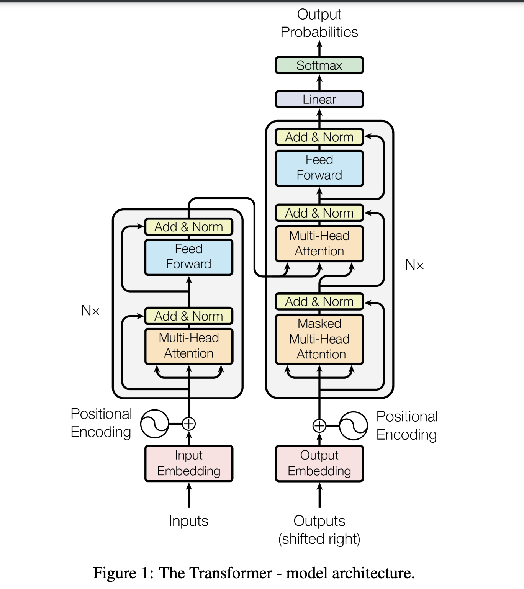

# transformer-from-scratch

This repository contains an implementation of the Transformer architecture from scratch, with a focus on English-to-Malayalam (an Indic language) translation. Malayalam was chosen because it is my mother tongue.

## Implementation Details

The implementation will be provided in both PyTorch and TensorFlow, with two approaches:
- **Letter-by-letter translation**  
- **Word-by-word translation**

## To Run:
```
sh run.sh
```

## Data

The dataset used for training comes from the [ai4bharat/samanantar](https://huggingface.co/datasets/ai4bharat/samanantar) available on HuggingFace. This dataset consists of English-to-Indic language pairs, specifically designed for machine translation tasks. For resource efficiency, I’ve limited the dataset to approximately 1 million pairs to minimize GPU usage.


## Transformer Architecture



*Figure 1: Image courtesy of [Original Transformer Paper](https://arxiv.org/pdf/1706.03762).*  

## Citation

If you use this project or related methods, please cite the [original Transformer paper](https://arxiv.org/pdf/1706.03762):

### BibTeX Format:
```bibtex
@inproceedings{vaswani2017attention,
  title={Attention is all you need},
  author={Vaswani, Ashish and Shazeer, Noam and Parmar, Niki and Uszkoreit, Jakob and Jones, Llion and Gomez, Aidan N and Kaiser, Łukasz and Polosukhin, Illia},
  booktitle={Advances in Neural Information Processing Systems (NeurIPS)},
  volume={30},
  year={2017}
}
```

### Courtesy
I would like to express my gratitude to the following sources for their inspiration and educational content:

- [StatQuest with Josh Starmer's Transformer Series](https://www.youtube.com/watch?v=zxQyTK8quyY)
- [Andrej Karpathy's video on building ChatGPT](https://www.youtube.com/andrejkarpathy)
- [CodeEmporium's Transformer Series](https://www.youtube.com/watch?v=Xg5JG30bYik&list=PLTl9hO2Oobd97qfWC40gOSU8C0iu0m2l4&index=11)

